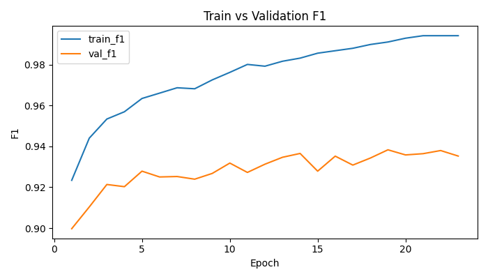
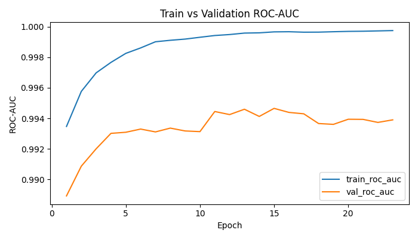
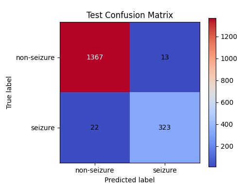
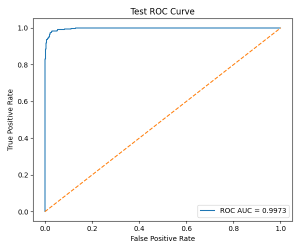
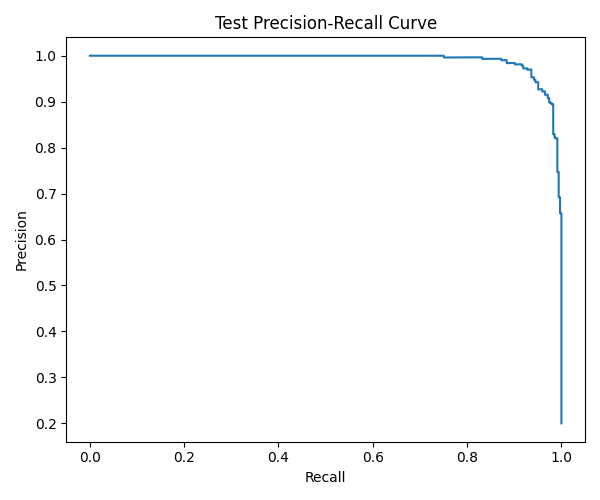
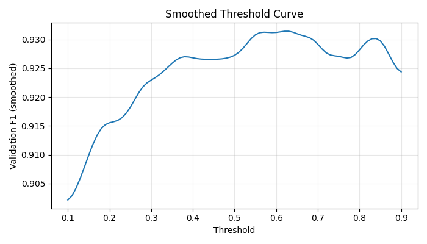
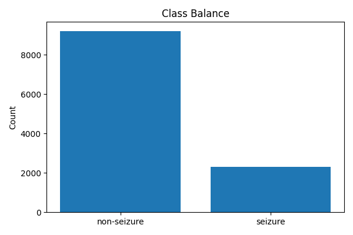

# Seizure Monitoring Demo

Research/demo simulator only. Not for clinical use.

This project is a React + Vite frontend with an optional FastAPI backend for artifact APIs and future model-serving. The frontend works on its own using files in `public/data/`.

## Frontend

Run the frontend:

```powershell
npm install
npm run dev
```

## Backend

Run the backend from `backend/`:

```powershell
python -m venv .venv
.\.venv\Scripts\Activate.ps1
pip install -r requirements.txt
uvicorn app.main:app --reload --host 127.0.0.1 --port 8000
```

API docs:

```text
http://127.0.0.1:8000/docs
```

## Backend-connected Frontend

To make the frontend call the backend, create `.env.local` in the project root:

```env
VITE_API_BASE_URL=http://127.0.0.1:8000
```

Then restart the frontend dev server.

If `VITE_API_BASE_URL` is missing or the backend is down, the frontend falls back to local artifact mode automatically.

## Artifact Files

Place exported files here:

```text
public/data/config.json
public/data/history.csv
public/data/test_predictions.csv
public/data/threshold_table.csv
```

Optional files:

```text
public/data/class_distribution.png
public/data/confusion_matrix.png
public/data/loss_per_epoch.png
public/data/smoothed_threshold_curve.png
public/data/test_precision_recall.png
public/data/test_roc.png
public/data/train_vs_val.png
public/data/train_vs_val_roc.png
public/data/preprocessing.joblib
public/data/seizure_mlp_state_dict.pt
```

Missing optional files do not crash the UI.

## Visuals

Training summary:





Evaluation outputs:









Dataset context:



## Mock Inference

The browser does not run the `.pt` model directly.

Without backend inference, the app uses deterministic mock inference:

- synthetic feature vectors are generated from saved prediction rows
- mock probability is computed from a seeded weighted combination of those features
- feature perturbations and confidence presets change the output predictably

This is meant for simulation and UX, not clinical validity.

## Switching to Backend Inference

Current backend prediction endpoints:

- `POST /predict`
- `POST /predict-batch`

They currently return deterministic mock inference from the backend.

To switch to real model inference later, the backend would need to:

1. recreate the PyTorch MLP architecture from `config.json`
2. load `seizure_mlp_state_dict.pt`
3. load `preprocessing.joblib`
4. apply preprocessing to incoming features
5. return probability and label using the chosen threshold

## Playback

Playback uses saved rows from `test_predictions.csv`.

- play
- pause
- step forward
- step back
- reset
- 0.5x / 1x / 2x / 4x speeds

Threshold crossings generate simulated alert events. Reset clears the event log. Threshold and playback speed are persisted locally.

## Limitations

- simulated playback only
- not raw EEG streaming
- synthetic feature controls are not raw EEG channels
- backend real PyTorch inference is not implemented yet
- not for clinical use
